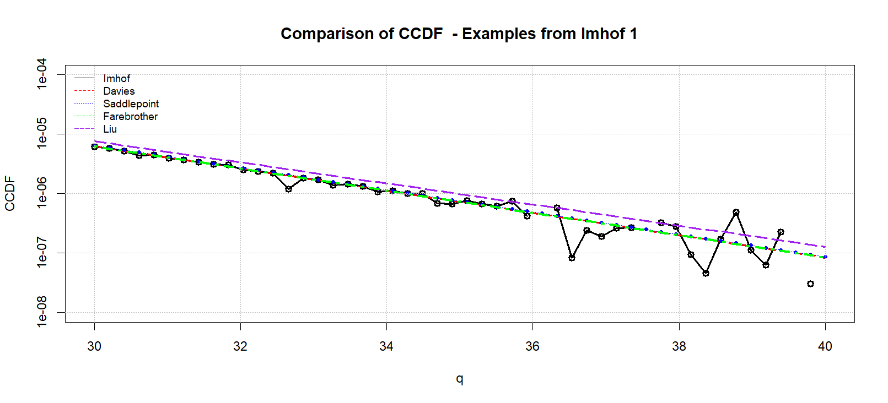

# Comparison of Computational Methods for Quadratic Forms in Gaussian Random Variables

A quadratic form in gaussian random variables is a function $Q$ of the form $Q = x^TAx$ where $x \sim \mathcal{N}(\mu, \Sigma)$ is  gaussian random variable of mean $\mu$ and covariance matrix $\Sigma$. The cumulative density function of $Q$ is denoted $F_Q(q)$ defined as: $F_Q(q) = \mathbb{P}[Q \leq q]$ and its derivative is the probability density function $f_Q(q)$.

There are many software libraries and packages to compute these $F_Q$ and $f_Q$. In [`R-Language`](https://www.r-project.org/) there are packages such as: [`CompQuadFrom`](https://cran.r-project.org/web/packages/CompQuadForm/index.html), [bigQF](https://cran.r-project.org/web/packages/bigQF/index.html) and others. 

In this repository we compare the performance of these computational methods. We also aim to investigate where these packages do not work. 

